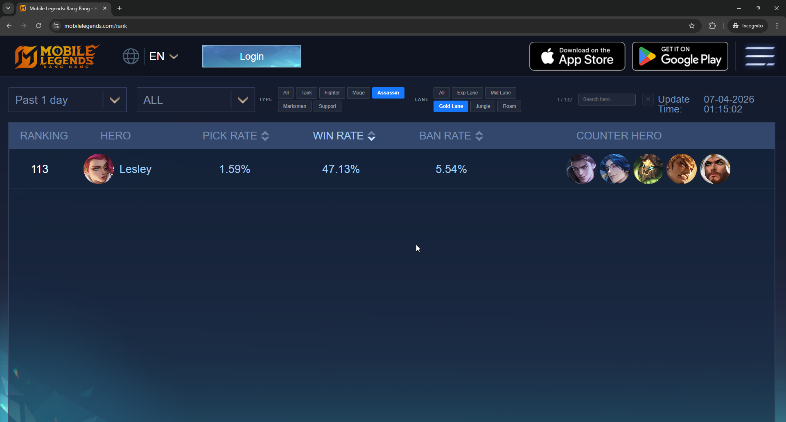

# MLBB Rank Filter (Chrome Extension)

A Chrome extension that adds a powerful filter bar to [mobilelegends.com/rank](https://www.mobilelegends.com/rank), letting you quickly filter heroes by role, lane, or name directly on the page.

> **[Install from Chrome Web Store](https://chromewebstore.google.com/detail/mlbb-rank-filter/faagniomjpmaakgiafmflbbpnklmmhao)**

## ✨ Features

* 🔍 Filter heroes by **role** (Tank, Fighter, Mage, Assassin, Marksman, Support)
* 🗺️ Filter by **lane** (Exp, Mid, Gold, Jungle, Roam)
* 🔎 Real-time **search by hero name**
* ⚡ Lightweight and fast (auto-load + smart DOM filtering)
* 💾 Persistent filter state (saved via localStorage)
* 🌐 Remote hero data with **cache + fallback mechanism**

---

## 🧠 How It Works

This extension injects a custom filter bar into the MLBB stats page and dynamically filters hero rows based on:

* Selected role
* Selected lane
* Search keyword

Hero metadata is fetched from a public GitHub JSON file and cached locally with a TTL (24 hours).
If the remote source fails, the extension automatically falls back to a bundled local file.

---

## 🧱 Tech Stack

* JavaScript (Vanilla)
* Chrome Extension (Manifest V3)
* DOM MutationObserver
* localStorage (state + cache)

---

## 📦 Installation (Development)

1. Clone this repository:

```bash
git clone https://github.com/ptrawt/mlbb-rank-filter.git
```

2. Open Chrome and go to:

```
chrome://extensions
```

3. Enable **Developer mode**

4. Click **Load unpacked**

5. Select the project folder

---

## 🚀 Usage

1. Open [mobilelegends.com/rank](https://www.mobilelegends.com/rank)
2. Wait for the filter bar to appear at the top
3. Use:

   * Role buttons (Tank, Fighter, Mage, ...)
   * Lane buttons (Exp, Mid, Gold, Jungle, Roam)
   * Search input
   * YouTube / TikTok icons next to each hero name to search gameplay videos
4. Results update instantly

---

## 🔄 Data Source

Hero metadata is loaded from:

```
https://raw.githubusercontent.com/ptrawt/MLBB-Rank-Filter/main/hero_map.json
```

### Caching Strategy

* Cached in localStorage
* TTL: 24 hours
* Fallback to local file if remote fetch fails

---

## 🔐 Privacy

This extension:

* ❌ Does NOT collect personal data
* ❌ Does NOT track user activity
* ❌ Does NOT send user data externally

It only fetches static hero metadata from a public GitHub repository.

---

## 📸 Screenshots

### Search


---

## 📌 Roadmap

* [ ] Add win rate / pick rate filters
* [ ] Add sorting (by win rate, popularity)
* [ ] UI improvements
* [ ] Support more MLBB pages

---

## 🛠️ Development Notes

* Uses MutationObserver to detect dynamic page updates
* Automatically scroll-loads all heroes before applying filters
* Designed to be resilient against layout changes

---

## 🤝 Contributing

Feel free to open issues or submit pull requests.

---

## 📄 License

MIT License

---

## 👨‍💻 Author

Built by ptrawt
